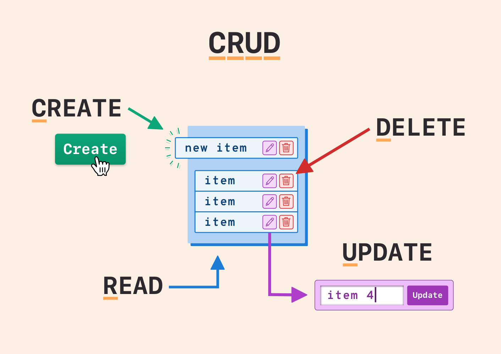
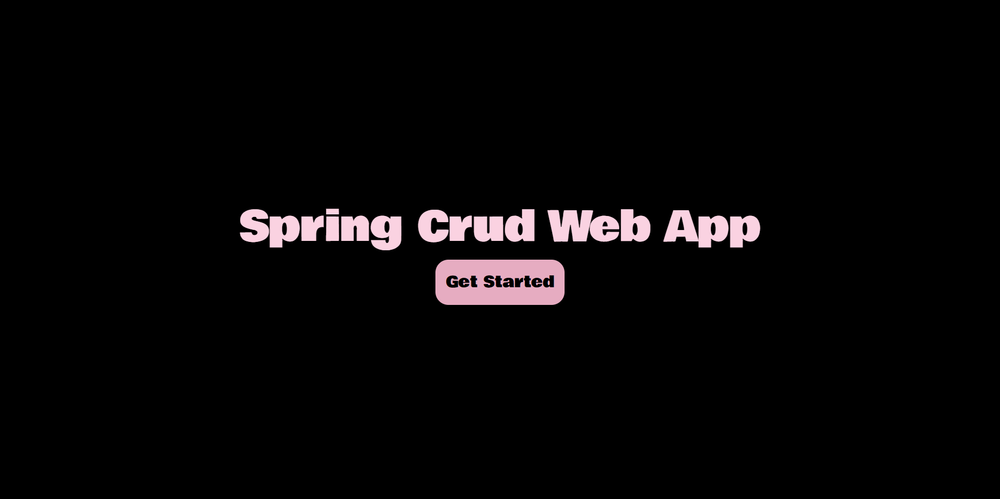
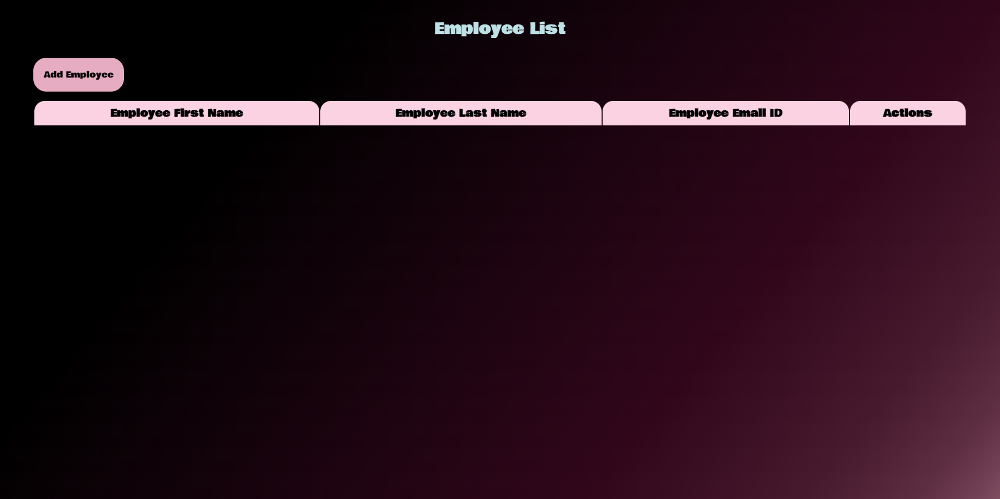
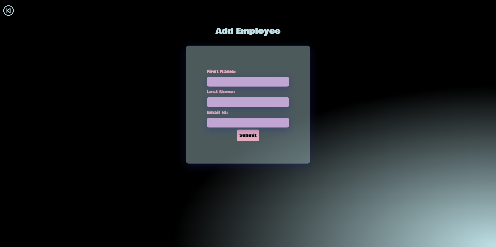

<div align="center">
  
</div>

<div align="center">
  
  
  
  
</div>

## What is CRUD?

CRUD stands for Create, Read, Update, and Delete, which are the basic operations that can be performed on data in a database or data storage system. This concept is fundamental to database management and is often used in the context of web development, software engineering, and data management.

<div align="center">
  
</div>

[Source of this image](https://docs.remaketheweb.com/static/crud-diagram.png)

In this CRUD application, we are managing an employee list with fields such as firstname, lastname, and email.

## Techstack Used

- **Backend:**
  - Spring - A comprehensive framework for enterprise Java development.

- **Frontend:**
  - React - A popular JavaScript library for building user interfaces.
  - Vite - A fast build tool for modern JavaScript projects.

- **Database:**
  - MySQL - A relational database management system.

## How does a Spring based CRUD operation works?

A Spring-based CRUD (Create, Read, Update, Delete) operation typically involves creating a web application that performs these basic database operations. Here, I'll provide a simple example using Spring Boot and Spring Data JPA for data persistence.

1. **Create a Spring Boot Project:**
   You can use Spring Initializer (https://start.spring.io/) or your favorite IDE to create a new Spring Boot project. Include the dependencies for "Spring Web" and "Spring Data JPA."

2. **Define Entity Class:**
   Define a class with `@Entity` to signify a JPA entity, encapsulating data to be stored. This class serves as a blueprint for objects persisted in a database in Spring applications.

```java
@Entity
public class Item {
    @Id
    @GeneratedValue(strategy = GenerationType.IDENTITY)
    private long id;

    @Column(name = "first_name")
    private String firstName;

    @Column(name = "last_name")
    private String lastName;

    @Column(name = "email_id")
    private String emailId;
}
```

3. **Create Repository Interface:**
   Create a repository interface extending `JpaRepository` for entity CRUD operations. JpaRepository provides pre-built methods for common database operations, simplifying data access code in Spring applications.

```java
import org.springframework.data.jpa.repository.JpaRepository;

@Repository
public interface EmployeeRepository extends JpaRepository<Employee, Long> {
}
```

4. **Implement Service Layer:**
   Develop a service class that communicates with the repository, encapsulating methods for Create, Read, Update, and Delete (CRUD) operations, providing a clean abstraction for data manipulation in a Spring application.

```java
@Service
public class ItemService {
    private final ItemRepository itemRepository;

    @Autowired
    public ItemService(ItemRepository itemRepository) {
        this.itemRepository = itemRepository;
    }

    public List<Item> getAllItems() {
        return itemRepository.findAll();
    }

    public Optional<Item> getItemById(Long id) {
        return itemRepository.findById(id);
    }

    public Item saveItem(Item item) {
        return itemRepository.save(item);
    }

    public void deleteItem(Long id) {
        itemRepository.deleteById(id);
    }
}
```

5. **Create Controller:**
   Create a controller class for handling HTTP requests and facilitating communication with the service layer, ensuring seamless interaction between the web interface and backend functionality.

```java
@RestController
@RequestMapping("/items")
public class ItemController {
    private final ItemService itemService;

    @Autowired
    public ItemController(ItemService itemService) {
        this.itemService = itemService;
    }

    @GetMapping
    public List<Item> getAllItems() {
        return itemService.getAllItems();
    }

    @GetMapping("/{id}")
    public Optional<Item> getItemById(@PathVariable Long id) {
        return itemService.getItemById(id);
    }

    @PostMapping
    public Item addItem(@RequestBody Item item) {
        return itemService.saveItem(item);
    }

    @PutMapping("/{id}")
    public Item updateItem(@PathVariable Long id, @RequestBody Item item) {
        item.setId(id);
        return itemService.saveItem(item);
    }

    @DeleteMapping("/{id}")
    public void deleteItem(@PathVariable Long id) {
        itemService.deleteItem(id);
    }
}
```

This example demonstrates a basic Spring Boot application with CRUD operations using Spring Data JPA. Keep in mind that you may need to configure your database connection properties in the `application.properties` or `application.yml` file based on your database choice (e.g., MySQL, PostgreSQL, H2).

## ScreenShots of the Application

<div align="center">
  
</div>

<div align="center">
  
</div>

<div align="center">
  
</div>

## How to Set Up Locally

1. **Clone the Repository:**
   ```bash
   git clone https://github.com/bishakhne0gi/Spring-Crud.git
   ```

2. **Backend Setup:**
   - Download MySQL from [Here](https://www.mysql.com/downloads/)
   - Start the MySQL server by using [MySQL Workbench](https://www.mysql.com/downloads/), [Table Plus](https://tableplus.com/) or similar application.
   - Navigate to the `server-side/src/main/java/com/crud/serverside/ServerSideApplication.java` directory.
   - Run the Spring Boot application using GUI by clicking Run Java.

3. **Frontend Setup:**
   - Navigate to the `frontend` directory.
   - Install dependencies:
     ```bash
     npm install
     ```
   - Start the development server:
     ```bash
     npm run dev
     ```

4. **Access the Application:**
   Open your browser and go to [http://localhost:3000](http://localhost:3000) to access the CRUD application.

## License

This project is licensed under the [MIT License](LICENSE).

## Conclusion

You have successfully set up the CRUD application locally. Feel free to explore, modify, and enhance the code to suit your needs. If you encounter any issues or have suggestions, please open an issue or create a pull request.